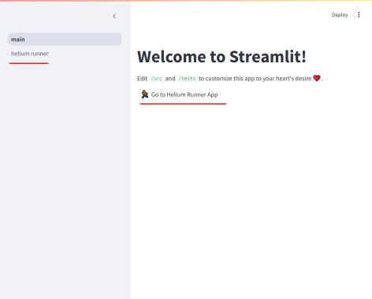
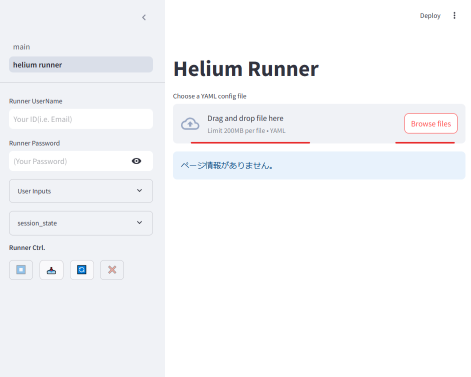
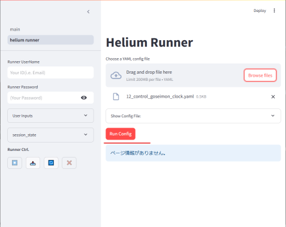
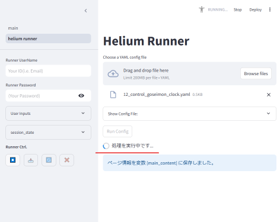
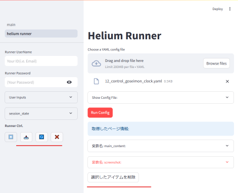
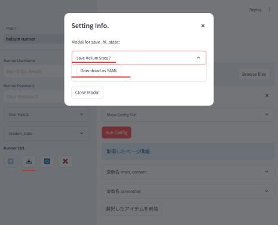

<!-- helium_runner_config.md -->
###### [backToREADME](../README.md)
# Helium Runner 設定ファイル
Helium Runner アプリで利用する設定ファイルについて説明します。

## 設定ファイルの利用方法
[toTop](#backtoreadme)

- `assets`フォルダにサンプルファイルを格納してます
  - サンプルファイルを例にアプリ起動後からの利用例を紹介します

### １．アプリ起動から設定ファイル読み込み
- `task run`などで起動してブラウザでアクセス

01．`Helium Runner`ページへ遷移 | 02．ファイル読み込み
--|--
サイドメニューかリンクより繊維 | ドラッグ＆ドロップか、`Browse files`から読込み
 | 

### ２．`Run Config`で実行
- `Run Config`ボタンをクリックして実行
  - （ブラウザが起動され設定ファイルに沿って操作されます）

03．`Run Config`クリック | 04．実行終了を待機
--|--
設定変更する場合は<br>`User Inputs`から変更し`Run Config` | 終了まで待機。もしくは、<br>サイドメニューの⏹️で停止
 | 


### ３．実行後、取得情報を確認
- 実行したあと、取得した情報がページの下段に追加されます
  - 折りたたみを広げて目視確認か、サイドメニューの📥（ダウンロードアイコン）から取得情報ファイルを確認できます

05．実行終了後の画面 | 06．取得情報のダウンロード
--|--
 | 


## stapp-helium-runnerでのYAML設定ファイル
[toTop](#backtoreadme)

- `stapp-helium-runner`プロジェクトでは、YAMLファイルを使用して自動化タスクを定義します.
- 設定ファイルは、大きく分けて以下の要素で構成されます。
  *   `hl_start_browser`: ブラウザの起動設定
  *   `actions`: 実行するアクションのリスト
  *   `hl_end_action`: 終了時のアクション

## 各設定項目の詳細：`hl_start_browser`の定義
[toTop](#backtoreadme)

- `hl_start_browser`は、HeliumでWebブラウザを起動する際の設定を記述します。
  * `name`: 起動するブラウザの種類を指定します。chromeまたはfirefoxを指定できます。
  * `start_url`: 最初に開くURLを指定します。

### 例:
```yaml
hl_start_browser:
  name: "chrome"
  start_url: "https://www.google.com"
```

## 各設定項目の詳細：`actions`の定義
[toTop](#backtoreadme)

- `actions`セクションでは、実行するアクションをリスト形式で定義します.
- 各アクションは、`type`フィールドでアクションの種類を指定し、その他のフィールドでアクションの詳細な設定を行います。
- 以下は、`run_hl_actions.py`でサポートされているアクションの種類とその説明です。

- **`hl_write`**:
  *   指定されたテキストをWebページに書き込みます。
  *   `text`: 書き込むテキスト
  *   `target`: 書き込み先の要素（オプション）

- **`hl_write_user_key`**:
  *   ユーザーが入力したキーをWebページに書き込みます。
  *   `key`: セッションステートに保存されているキーの名前
  *   `target`: 書き込み先の要素
- **`hl_click`**:
  *   指定された要素をクリックします。
  *   `target`: クリックする要素の名前
  *   `user_target`: ユーザー入力からターゲット名を取得する場合のキー（オプション）
  *   `user_default`: ユーザー入力が存在しない場合のデフォルト値（オプション）
- **`hl_press`**:
  *   指定されたキーを押します。
  *   `value`: 押すキーの名前（現在`ENTER`のみサポート）
  *   `key`: 押すキーの名前（`value`の別名）
- **`hl_wait`**:
  *   指定された秒数だけ待機します。
  *   `seconds`: 待機する秒数
  *   `user_seconds`: ユーザー入力から秒数を取得する場合のキー（オプション）
  *   `user_default`: ユーザー入力が存在しない場合のデフォルト値（オプション）
- **`hl_go_to`**:
  *   指定されたURLに移動します。
  *   `url`: 移動先のURL
  *   `user_url`: ユーザー入力からURLを取得する場合のキー（オプション）
  *   `user_default`: ユーザー入力が存在しない場合のデフォルト値（オプション）
- **`hl_scrape_page`**:
  *   指定されたWebページの情報をスクレイピングします。
  *   `variable`: スクレイピング結果を保存するセッションステートのキー
  *   `target`: スクレイピング対象の要素（オプション、デフォルトは`all`）


## 各設定項目の詳細：`hl_end_action`の定義
[toTop](#backtoreadme)

- `hl_end_action`は、Heliumのアクション実行後の終了処理を指定します。
  * `kill_browser`: ブラウザを閉じます。
  * `stop_run`: 実行を停止し、ユーザーに確認を求めるダイアログを表示します。
  * `get_screen`: スクリーンショットを取得し、セッションステートに保存します。

### 例:
```yaml
hl_end_action: "kill_browser"
```

## YAML設定ファイルの例
[toTop](#backtoreadme)

### 例1：Google検索

この例では、Googleを開き、検索キーワードを入力して検索します。

```yaml
hl_start_browser:
  name: "chrome"
  start_url: "https://www.google.com"

actions:
  - type: "hl_write"
    text: "Helium"
    target: "検索"
  - type: "hl_click"
    target: "Google検索"

hl_end_action: "stop_run"
```

### 例2：ユーザー入力とWebスクレイピング

この例では、URLをユーザーに入力させ、そのページのタイトルとURLをスクレイピングして表示します。

```yaml
hl_start_browser:
  name: "chrome"
  start_url: "https://www.google.com"

actions:
  - type: "hl_go_to"
    user_url: "user_input_0"
    user_default: "https://www.example.com"
  - type: "hl_scrape_page"
    variable: "page_info"

hl_end_action: "get_screen"
```

この例では、`user_input_0`というキーでユーザー入力を受け付け、その値をURLとして使用します。スクレイピング結果は`page_info`というキーでセッションステートに保存されます。

---
Perplexity の Eliot より: pplx.ai/share